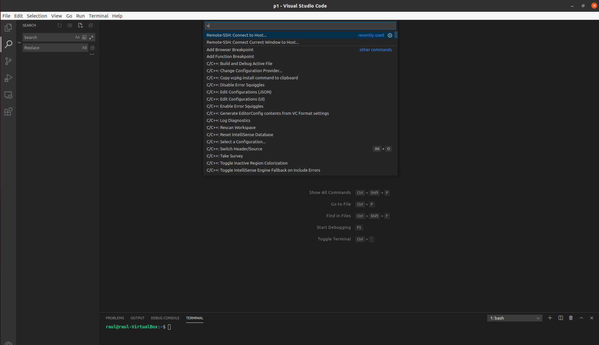
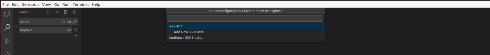
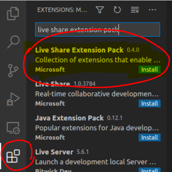
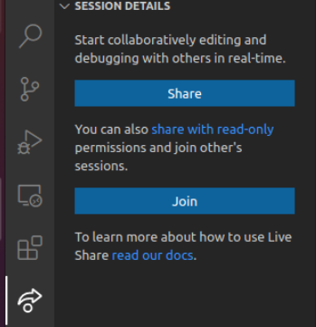
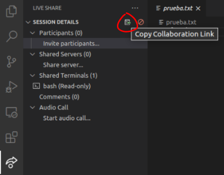
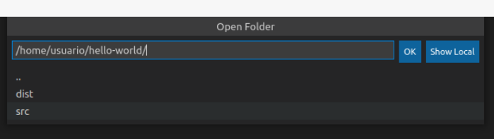
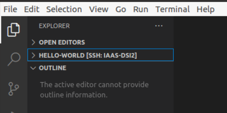

# Práctica 2: Instalación y configuración de Visual Studio Code. Informe.
## Desarrollo de Sistemas Informáticos 
## Raúl Martín Rigor - alu0101203003@ull.edu.es

### Introducción

En este informe se resumen las actividades realizadas en la **práctica 2** para entender el funcionamiento de *Visual Studio Code*, instalarlo y configurarlo adecuadamente para la realización de prácticas posteriores.

### Objetivos

Al finalizar la práctica, habremos completado los siguientes objetivos:

* Tener instalado Visual Studio Code.
* Poder acceder a nuestra máquina virtual desde el propio Visual Studio Code.
* Saber hacer uso de las sesiones colaborativas.
* Tener nociones básicas de TypeScript.

### 1. Instalación VS Code y conexión inicial.

#### 1.1. Instalación

Si no se ha realizado previamente, debemos instalar Visual Studio Code. Una de las maneras de llevar esta tarea a cabo es haciendo uso del comando: `sudo snap install code --classic`. Podemos configurar nuestras preferencias en el programa a nuestro gusto, para ello (y para entender con mayor detalle el funcionamiento del programa) se recomienda hacer uso de la guía oficial de VS Code: [Visual Studio Docs](https://code.visualstudio.com/docs).

#### 1.2. Conexión remota

Debemos recordar que la instalación se ha llevado a cabo de manera local. Para poder usar VS Code en nuestra máquina virtual debemos conectarnos de manera remota por ssh desde el programa. (Para poder realizar una conexión ssh a nuestra máquina virtual es necesario haber completado la [práctica 1](https://github.com/ULL-ESIT-INF-DSI-2021/ull-esit-inf-dsi-20-21-prct01-iaas-alu0101203003/blob/gh-pages/index.md)).

Para conectarnos desde VS Code, presionamos la tecla `f1` y seleccionamos la opción de *Remote-SSH: Conect to host...* :


Y elegimos el host de nuestra máquina:


### 2. Extensiones y complementos

Tenemos que ser conscientes de que las extensiones o cambios que hagamos conectados por ssh se harán efectivos solo en la máquina virtual. La máquina local está desvinculada de estos cambios y, si los queremos también para ella, deberemos realizarlos de nuevo localmente.

Aclarado esto procederemos a instalar una serie de extensiones que nos serán de utilidad en nuestra máquina virtual.

#### 2.1. LiveShare. Sesiones colaborativas

Para hacer uso de las sesiones colaborativas instalaremos el *Live Share Extension Pack* con la ayuda del administrador de extensiones:

  

Con el botón *Share* empezará una sesión y podremos compartir el link con los usuarios que se quieran conectar. De esta manera se podrá hacer uso de las sesiones colaborativas para trabajar de manera conjunta en un proyecto con otro usuario.

#### 2.2. Extensiones adicionales

Instalaremos otra extensión llamada [ESLint](https://eslint.org/) que nos permitirá comprobar nuestro código de JavaScript y TypeScript en busca de errores de estilo.

De manera opcional podemos instalar la extensión de VIM si usamos dicho editor de texto con regularidad.

### 3. Manejo de TypeScript

#### 3.1. Instalar el compilador

Para poder compilar código escrito en TypeScript debemos instalar el compilador:

```bash
[~()]$npm install --global typescript

added 1 package, and audited 2 packages in 2s

found 0 vulnerabilities
[~()]$tsc --version
Version 4.2.2
```

#### 3.2. Directorio hello-world

Crearemos un nuevo directorio hello-world donde se alojará nuestro programa y le asignaremos un archivo *package.json* (creado con el comando `npm init --yes`) que nos permitirá establecer las dependencias del proyecto:

```bash
[~()]$pwd
/home/usuario
[~()]$mkdir hello-world
[~()]$cd hello-world/
[~/hello-world()]$npm init --yes
Wrote to /home/usuario/hello-world/package.json:

{
  "name": "hello-world",
  "version": "1.0.0",
  "description": "",
  "main": "index.js",
  "scripts": {
    "test": "echo \"Error: no test specified\" && exit 1"
  },
  "keywords": [],
  "author": "",
  "license": "ISC"
}

[~/hello-world()]$ls -lrtha
total 12K
drwxr-xr-x 26 usuario usuario 4,0K feb  22 11:02 ..
drwxrwxr-x  2 usuario usuario 4,0K feb  22 11:02 .
-rw-rw-r--  1 usuario usuario  225 feb  22 11:02 package.json
[~/hello-world()]$

```
#### 3.3. Configuración del directorio

Para tener acceso al directorio y poder añadir/modificar archivos abriremos la carpeta con el explorador de archivos:

 

Crearemos un fichero *tsconfig.json* que nos permitirá configurar el compilador para que genere código compatible con los estándares de js, que el código resultado se almacene en el directorio dist y que busque el código fuente en el directorio src. Para lograr esto, el archivo contendrá las siguientes lineas de código:

```bash
[~/hello-world()]$touch tsconfig.json
[~/hello-world()]$cat tsconfig.json 
{
  "compilerOptions": {
    "target": "ES2018",
    "outDir": "./dist",
    "rootDir": "./src",
    "module": "CommonJS"
  }
}
```
#### 3.4. Compilación y ejecución del HolaMundo

El código fuente de nuestro programa será un fichero

